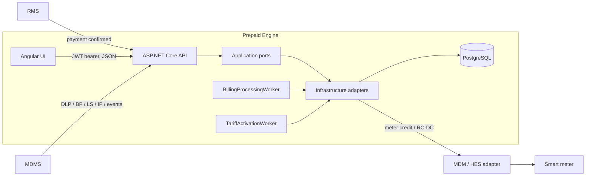
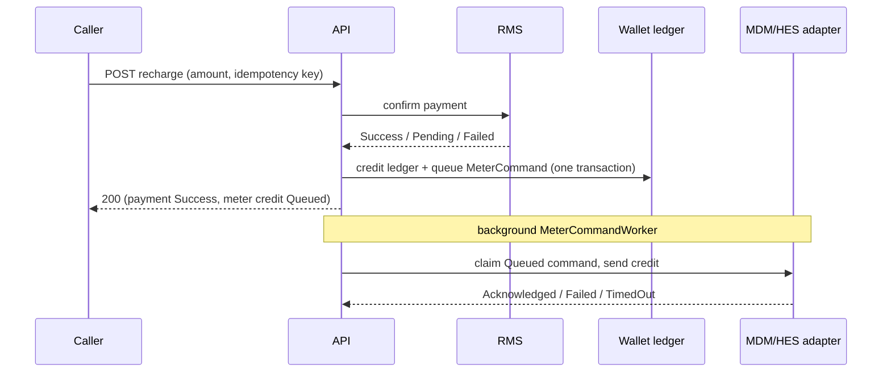
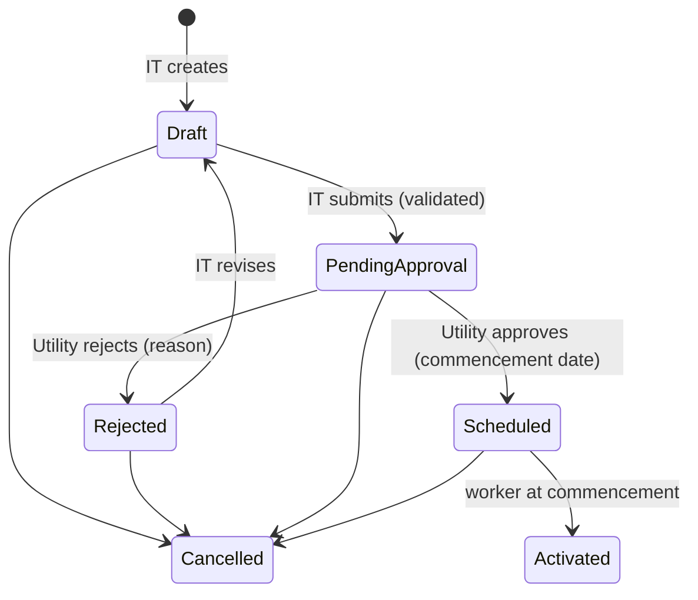

# Prepaid Engine — Architecture

This is the single architecture reference for the repository. It describes the system as built, not
as planned; anything not built is listed under [Known gaps](#12-known-gaps). Domain calculation rules
(tariff slabs, FPPAS, TMC/CPMC, arrears, ToD, the DLP billing pipeline) are in
[DOMAIN_RULES.md](DOMAIN_RULES.md); sourcing and the security checklist are in
[assumptions-and-security.md](assumptions-and-security.md).

## 1. Purpose and system boundaries

The Prepaid Engine manages the prepaid lifecycle for smart-meter consumers: wallet and recharge,
tariff-driven billing, tariff governance, meter-command orchestration (credit, disconnect,
reconnect), and the operations UI on top of it.

| System | Owns | Never owned by the engine |
|---|---|---|
| **RMS** | Payment truth, consumer/billing source system | |
| **Prepaid Engine** (this repo) | Wallet ledger, recharge transactions, prepaid bills, tariff versions and approval workflow, command orchestration state, exceptions, reconciliation, prepaid audit | Raw meter data universe |
| **MDMS** | Meter data (DLP, BP, LS, IP, events, alarms) | |
| **HES** | Meter communication and command execution | |
| **Meter** | The actual credit and tariff execution | |
| **WFM** | Field workflow | (not integrated) |

Two rules shape most of the design:

1. **A received payment is not a credited meter.** RMS confirming payment, the wallet ledger being
   credited, and the meter acknowledging the credit are three separate facts with separate statuses.
   Nothing marks a recharge "fully successful" until the meter acknowledges.
2. **A tariff row is never edited.** Every approved change creates a new immutable `Tariff` row and
   retires the previous one at its commencement date, so a bill's `TariffId` always points at the
   exact rates it was calculated with. Historical bills never change.



The MDM/HES, RMS and connectivity adapters are **mocks** today (`Mock*Client`); the interfaces they
implement are the integration seams. No production DLMS/COSEM, OBIS or vendor payload is assumed.

## 2. Solution layout

```
backend/
  PrepaidEngine.Domain          entities, enums, business rules — no dependencies
  PrepaidEngine.Application     ports: IRmsClient, IMeterCommandClient, IConnectivityCommandClient,
                                IPaymentModeChangeClient, IBillingEngineService, IMeterDataIngestionService,
                                ISlaMonitoringService, IEmergencyCreditGuard, request/response models
  PrepaidEngine.Infrastructure  EF Core + Npgsql, migrations, adapters (Mock*), BillingEngineService,
                                MeterDataIngestionService, SlaMonitoringService, TariffActivationService, DbSeeder
  PrepaidEngine.Api             minimal-API host: Program.cs (wiring only), Endpoints/ (one file per module),
                                Auth/, Security/, Reports/, Dashboard/, background workers
  PrepaidEngine.Tests           xUnit (domain rules, services, EF mapping on SQLite in-memory)
frontend/                       Angular 22, standalone components, plain SCSS design tokens
docs/                           this file, DOMAIN_RULES, assumptions-and-security, tariff-validation-report
```

Dependency direction is Domain ← Application ← Infrastructure ← Api. Domain entities enforce their
own invariants (constructors and mutators throw on invalid state); endpoints translate those
exceptions to 400/409.

## 3. Backend

### 3.1 Startup and wiring (`Program.cs`)
`Program.cs` is about 200 lines of wiring only: services, authentication, middleware, the deny-by-default guard and one
`Map...Endpoints()` call per module. The routes live in `Endpoints/`: `ConsumerEndpoints` (consumers, recharge,
disconnect/reconnect, meter replacement), `ConnectivityEndpoints`, `BillingEndpoints`, `TariffEndpoints` (tariffs,
change requests, workbench), `RechargeEndpoints` (recharges, meter commands), `ConversionEndpoints` (conversions,
reconciliation), `OperationsEndpoints` (exceptions, notifications, SLA, risk), `AuditEndpoints`, `AnalyticsEndpoints`,
`MeterDataEndpoints` and `PlatformEndpoints` (health, whoami). `ApiHelpers` holds the shared helpers (audit and
exception recording, cursor parsing) and `ApiModels` the request records. Reports, network, dashboard and auth
endpoints have their own folders.
- `AddDbContext<PrepaidEngineDbContext>` (Npgsql), connection string `ConnectionStrings:PrepaidEngine`.
- Singletons: `IRmsClient`, `IMeterCommandClient`, `IConnectivityCommandClient`, `IPaymentModeChangeClient`
  (all mocks). Scoped: `IEmergencyCreditGuard`, `IBillingEngineService`, `IMeterDataIngestionService`,
  `ISlaMonitoringService`, `TariffActivationService`.
- Options: `EnergyValidation`, `SlaMonitoring` (targets are configuration, not constants).
- Hosted services: `BillingProcessingWorker`, `TariffActivationWorker` (section 3.5).
- In **Development only** the app applies pending migrations and seeds demo data (`DbSeeder`:
  `DEMO-0001` plus six more consumers, idempotent per account number).
- `Security/` wires CORS (`Security:AllowedOrigins`), the rate limiters, security headers, HSTS, the request body
  cap and optional forwarded-header handling; `UseApiSecurity` runs before authentication.
- `/health` is open; every `/api/v1/*` endpoint requires authentication.

### 3.2 Authentication and authorization
- JWT bearer auth (`Auth/`): `AuthEndpoints` (`POST auth/login`, `POST auth/refresh`), `UserStore` (users from
  `DemoAuth:Users`: login id, display name, role, PBKDF2 `PasswordHash`), `PasswordHasher`, `TokenService`
  (HS256, claims: name, display_name, role, auth_time), and `LoginThrottle` (5 failures, 15-minute lock).
  `Jwt:Key` is a secret; the legacy single `DemoAuth:Username/Password` pair still works as one `IT` user.
  `dotnet run --project backend/PrepaidEngine.Api -- hash-password "<pw>"` prints a hash for the config.
- Roles: `Admin`, `IT`, `Operator`, `Utility`, `ReadOnly`. Policies: `Authenticated`, `Operations` (Admin/IT/Operator),
  `DataAdmin` (Admin/IT), `ITRole` (Admin/IT), `UtilityRole` (Utility), `TariffGovernanceRole` (Admin/IT/Utility).
- **Deny by default:** at startup `Program.cs` scans every endpoint (read from the app's own route builder, because the DI endpoint list is empty until the host starts) and throws if a POST/PUT/PATCH/DELETE (other than
  sign-in) has no named policy, so a new write endpoint cannot ship unprotected.
- Role-gated endpoints (the frontend hides buttons via `peOperate` and `AuthService.canOperate`, but the API is the boundary):

| Endpoint | Policy |
|---|---|
| create / edit-draft / submit tariff change request, `tariffs/{id}/versions` | `ITRole` |
| approve / reject tariff change request, `activate-due` | `UtilityRole` |
| cancel tariff change request | `TariffGovernanceRole` (IT/Admin: Draft/Rejected; Utility: PendingApproval/Scheduled) |
| recharge, disconnect, reconnect, connectivity/meter-command retry, conversions, reconciliation adjustments, exception resolve, meter replacement, billing-hold clear, alarm acknowledge/resolve | `Operations` |
| `meter-data/*` ingestion, energy validation, `billing/daily/*/stage1,2` | `DataAdmin` |
| calculation-workbench simulate | `Authenticated` |
| every GET | any authenticated user |

- Self-approval is blocked twice: an IT credential cannot reach `approve`, and `TariffChangeRequest.Approve`
  rejects the submitter as approver.
- `GET /api/v1/auth/whoami` returns the caller's login id, display name and role for UI convenience only.

### 3.3 Persistence
- One `PrepaidEngineDbContext`; entity configuration in `Persistence/Configurations`, migrations in
  `Persistence/Migrations` (22 so far, latest `AddReportJobs`).
- **UTC everywhere:** a model convention converts every `DateTime` to UTC on write and marks it UTC on
  read. This fixes Npgsql rejecting `Kind=Unspecified` values (date-only JSON or query inputs) for the
  whole API in one place.
- Money is `decimal(18,2)`; there is no floating point in financial paths.
- Idempotency is enforced by unique indexes: `RechargeTransactions.RmsReferenceId`, one `MeterCommand`
  per `RechargeTransactionId` (retries reuse the row), one `BillingRun` per `RunType + BillingDate`,
  and at most one **Active** `Tariff` per name (filtered unique index).
- Time-series tables (`DailyLoadProfiles`, `RegisterReadings`, `LoadSurveyIntervals`, `MeterEvents`,
  `MeterAlarms`) have time-ordered indexes for newest-first keyset paging.

Core entities (see DOMAIN_RULES.md for behaviour): `Consumer`, `SmartMeter`, `PrepaidWallet`,
`WalletTransaction`, `Tariff` (+ `TariffSlab`, `TouPeriod`), `TariffChangeRequest`, `TariffVersion`,
`PrepaidBill`, `ConsumptionReading`, `FppasCharge`, `RechargeTransaction`, `MeterCommand`,
`ConnectivityCommand`, `ConversionRequest`, `ReverseConversionRequest`, `PaymentModeChangeCommand`,
`ReconciliationAdjustment`, `OperationalException`, `AuditEntry`, `DailyLoadProfile`, `RegisterReading`,
`LoadSurveyInterval`, `InstantaneousReading`, `MeterEvent`, `MeterAlarm`, `EnergyValidationResult`,
`MeterBillingControl`, `BillingRun`, `MeterAssignment`, `NotificationEvent`.

### 3.4 API surface (`/api/v1`)
Grouped by module. "Search" endpoints are keyset-paginated (`items`, `nextCursor`, `totalCount`),
filtered in the database, page size 1–100 (default 25).

| Module | Endpoints |
|---|---|
| Consumers | `GET consumers` (capped at 1,000 rows), `GET consumers/search`, `GET consumers/{account}`, `PUT consumers/{account}/mobile`, `POST consumers/{account}/recharge`, `.../disconnect`, `.../reconnect`, `.../reconciliation-adjustments`, `POST consumers/{id}/meter-replacement`, `GET meter-replacements`, `GET consumers/{id}/notifications` |
| Recharge / meter credit | `GET recharges`, `recharges/search`, `recharges/summary`, `recharges/{id}`; `GET meter-commands`, `meter-commands/{id}`, `POST meter-commands/{id}/retry` |
| RC / DC | `GET connectivity-commands`, `connectivity-commands/{id}`, `POST connectivity-commands/{id}/retry` |
| Billing | `GET bills`, `bills/search`, `bills/summary`, `bills/{id}` (with per-slab breakdown), `POST billing/daily/{date}/stage1|stage2`, `GET billing-reconciliation/daily-export`, `POST calculation-workbench/simulate` |
| Tariffs | `GET tariffs`, `tariffs/{id}`, `tariffs/{id}/lineage`, `tariffs/{id}/versions` (+`POST`); change requests: `GET/POST tariff-change-requests`, `GET .../{id}`, `PUT .../{id}/draft`, `POST .../{id}/submit|approve|reject|cancel`, `POST .../activate-due` |
| Meter data | GET + `search` for `dlp`, `bp`, `ls`, `events`, `alarms`; `GET ip/latest`; POST ingestion for each (for MDMS); alarm `acknowledge`/`resolve`; `dlp-completeness`; energy validation; billing holds (`billing-holds`, `clear`, `clear-bulk`) |
| Conversion / reconciliation | `GET/POST conversions`, `conversions/{id}`, `GET/POST conversions/reverse`; `GET reconciliation-adjustments`, `.../{id}` |
| Operations | `GET exceptions`, `exceptions/{id}`, `POST exceptions/{id}/resolve`; `GET notifications`; `GET sla`; `GET risk-indicators` |
| Audit | `GET audit-entries` (optional `entityId`), `audit-entries/search` (rows carry `actorRole`, `sourceIp`, `correlationId`; `q` also matches a correlation id), `audit-entries/summary` |
| Reports | `GET reports/billing`, `day-wise-rc-dc`, `day-wise-recharge`, `recharge-failures`, `meter-credit-failures` — each `{ rows, truncated, generatedAt, totals? }`, 5,000-row cap. **Network hierarchy on every report:** all accept `zoneId`, `circleId`, `divisionId`, `subDivisionId`, `substationId`, `feederId`, `dtrId` filters; the three row-level reports return `zone`, `circle`, `division`, `subDivision`, `substation`, `feeder`, `dtr` on each row; the two day-wise reports take `level` (`zone`…`dtr`) and break each day down by that level in a `group` column |
| Network | `GET network/nodes?level=&parentId=` — the nodes at one level under a parent, for the cascading report filters; `GET network/summary` — counts per level and mapped/unmapped consumers; `POST network/import` — load the hierarchy from flat rows (one path down to a DTR per row); `POST network/consumer-mapping` — map consumers to DTRs by account number and DTR code. Both POSTs take `{ rows, dryRun }`, need the `DataAdmin` policy, accept up to 10,000 rows, match nodes by code (new code creates, changed name renames, a code under a different parent is an error), are **all-or-nothing** (any bad row saves nothing), report every problem by row, and write one audit entry when saved. `GET consumers/{account}` also returns the consumer's `network` path |
| Report exports | `POST report-jobs` (request a full CSV of `billing`, `recharge-failures` or `meter-credit-failures` with the report's date, status and network filters; `Operations` policy), `GET report-jobs` and `GET report-jobs/{id}` (your own; Admin/IT see all), `GET report-jobs/{id}/download` (`Operations`; requester or Admin/IT) |
| Analytics | `GET analytics/overview` — database-side aggregates over a bounded range; `GET analytics/balance-history` — the recorded daily wallet totals (consumers, active, disconnected, low balance, wallet total), oldest first, at most 366 days |
| Paged lists | `GET .../search` (keyset, newest first, `q` plus a status/type filter) and `GET .../summary` (counts in SQL) for `meter-commands`, `connectivity-commands`, `notifications`, `exceptions`, `conversions`, `reconciliation-adjustments` and `meter-replacements` |
| Dashboard | `GET dashboard/summary` — consumer/wallet counts and sums, latest-day billing progress, attention counts plus the newest 10 items, and the 4 latest connectivity commands, all computed in SQL |
| System | `GET system/health` (times a real database round trip, applied and pending migrations, each background worker's last success/failure and state, queue depths, recent billing runs, overall Healthy/Degraded/Down) and `GET system/integrations` (each outbound adapter with its class, Mock or Live, last activity and 24-hour OK/failed counts from the database; when each inbound MDMS/RMS feed last arrived) |
| Platform | `GET /health`, `POST auth/login`, `POST auth/refresh`, `POST auth/logout` (records the event), `GET auth/whoami`, Swagger in Development |

Several endpoints exist for external systems (RMS conversions, MDMS ingestion, billing daily-export)
and have no UI caller by design.

### 3.5 Background workers
| Worker | Behaviour |
|---|---|
| `BillingProcessingWorker` | Polls every minute; runs DLP billing Stage 1 (8:30–9:30) and Stage 2 (12:30–13:30, plus provisional billing) once per day. Safe on several API instances: a stage that is running elsewhere is retried on later ticks. |
| `WalletStatsWorker` | Records today's wallet totals at start-up and every hour into `DailyWalletStats` (one row per day, overwritten through the day, so the last reading stands). Counts come from one grouped SQL query with the dashboard's low-balance definition, so the two always agree. Totals only, never one row per consumer, so it stays small at any size. History starts at the first recorded day and is never back-filled. Safe on several instances (the date is the key) |
| `ReportJobWorker` | Polls every 5 s; builds queued report exports (see below) and, every 10 minutes, removes expired files and fails jobs left Running for over 2 hours |
| *Worker status* | All five workers report each round to `WorkerStatusRegistry` (in memory, per API instance): healthy means a success within three expected intervals plus 30 s. It feeds System Health |
| `MeterCommandWorker` | Polls every 2 s; sends queued meter credit commands (claimed, so safe on several instances) and times out commands stuck in `Sent`. See section 4.1. |
| `TariffActivationWorker` | Runs at startup and every minute; calls `TariffActivationService.ActivateDueAsync`. |

Both are simple in-process pollers. `TariffActivationWorker` is safe to run twice (each activation is its own transaction).

**Billing runs (batch, claimed, resumable).** `BillingEngineService.RunStageAsync` runs one stage for one date:
- *Claim:* the `BillingRuns` row is the claim. The unique `(RunType, BillingDate)` index lets exactly one instance create it. A run that is `Running` but has not heartbeated for 10 minutes can be taken over by another instance through a conditional `UPDATE`; a fresh one is left to its owner, and a finished one reports "already ran".
- *Batches:* consumers are read in key order, 500 at a time, with their DLPs, tariffs, holds and already-billed references loaded per batch. Each batch (debits, notifications, and the run's `ConsumerCount`, `ExceptionCount`, `ResumeAfterConsumerId` cursor and `LastHeartbeatAt`) commits as one transaction, then the change tracker is cleared, so memory stays flat at any population size.
- *Resume:* a takeover continues after the saved cursor. Debits are also idempotent on the DLP reference (`DLP:<id>`), so a repeated batch never bills a consumer twice.
- *Results:* the API returns at most 5,000 per-consumer results; the run row holds the true totals.
- Not yet done: a shared scheduler with run history and alerts, and batching the remaining per-consumer lookups (notification de-duplication, emergency-credit guard, provisional estimates).

`TariffActivationService` activates each due request **in its own transaction**: retire the superseded
tariff, insert the new one, mark the request `Activated`, write `ACTIVATED`/`RETIRED` audit entries. A
request that cannot activate (for example its superseded tariff is no longer Active) is reported and left
`Scheduled`; it never blocks the others. Re-running is safe.

## 4. Key flows

### 4.1 Recharge and meter credit

- The idempotency key is required from the caller; a repeated key replays the original result.
- `MeterCommand` states: Queued, Sent, Acknowledged, Failed, TimedOut; `Retry()` reuses the same row.
  It stores the external command id, response code/message, retry count, and timestamps.
- A `Failed`/`TimedOut` command auto-raises an `OperationalException`.
- **Outbox:** the recharge request never waits on the meter/MDM layer. It writes the wallet credit and a `Queued` `MeterCommand` in one transaction (the command row is the outbox) and returns at once with `meterCommandStatus: Queued`. `MeterCommandWorker` (poll every 2 s, batches of 50) runs `MeterCommandDispatcher`: it **claims** each command with a conditional `UPDATE` (Queued to Sent, so several instances never send one twice), sends it with a key stable for that attempt (`meter-credit:<id>:<retryCount>`, so a resend after a crash is safe), and records Acknowledged / Failed / TimedOut (Failed and TimedOut raise the operator exception as before).
- A command left `Sent` with no outcome for 10 minutes (its sender died) is marked `TimedOut` with an exception that says the meter may or may not have been credited. `POST meter-commands/{id}/retry` now just re-queues (and audits); the worker sends it. There is no automatic retry of failed commands: an operator decides. A partial index on `(Status, CreatedAt)` for `Queued`/`Sent` keeps the lookup cheap among millions of commands. Settings: `MeterCommandWorker:PollSeconds`, `BatchSize`, `StuckAfterMinutes`.
- The recharge and meter-credit detail pages refresh a few times while a command is Queued or Sent.

### 4.2 Tariff governance

- Submit validates slab continuity (starts at 0, no gaps/overlaps, only the last slab unbounded), rates,
  ToD windows (no overlap), vend limits, rebate range.
- Create, submit and approve all re-check: the tariff being revised must still be Active, no other
  pending/scheduled request may target it, and a proposed name may not collide with a different Active tariff.
- Activation creates a new `Tariff` (Active) and retires the old (Retired). `GET tariffs/{id}/lineage`
  returns the version chain with effective/retired times. Every action is audited with the real actor.

### 4.3 DLP billing
The Daily Load Profile is the sole driver of ongoing prepaid billing (BP/LS/IP are validation and
intelligence only). Stage 1 bills profiles received by 08:00; Stage 2 bills those received by 12:00 and
creates provisional charges for the rest. A reading lower than the meter's previous closing reading
raises a `MeterBillingControl` hold that blocks real billing until cleared. Details: DOMAIN_RULES.md.

### 4.4 Disconnect / reconnect, conversion, reconciliation
Disconnect/reconnect create a `ConnectivityCommand` (mandatory reason) dispatched through
`IConnectivityCommandClient`; the consumer's connection status records intent and only becomes final on
acknowledgement. Postpaid→prepaid conversions arrive in batches from RMS and drive a
`PaymentModeChangeCommand` (MDMS→HES→meter). Reconciliation adjustments are signed wallet entries tagged
distinctly in the ledger. All three write audit entries.

### Report exports (background jobs)
Report pages show at most 5,000 rows. A full export is a `ReportJob`: the request (report key plus filters) is stored as JSON and a worker builds a CSV in the background. It is claimed with a conditional update (Queued to Running, so several instances never build one file twice), fetched a chunk at a time with a keyset cursor (5,000 rows per chunk, so memory stays flat), written to `<name>.csv.part` and renamed only when complete (a download never sees a half-written file), and its row count is updated after every chunk. A job stops with an error over `ReportJobs:MaxRows` (5,000,000), a person may have 3 exports queued or running at once, and a file is removed after `ReportJobs:RetentionDays` (7). The CSV matches the report on screen including the seven network levels, is UTF-8 with a byte-order mark, and cells that a spreadsheet would run as a formula (starting `=`, `+`, `-`, `@`) are prefixed with a quote. Requesting and downloading need the `Operations` policy (an export can hold every consumer's details), and both are audited (`REPORT_EXPORT_REQUESTED`, `REPORT_EXPORT_DOWNLOADED`). The web app has "Export everything (background)" on the three row-level reports and a Report exports page that follows the jobs. **Storage is a local directory** (`ReportJobs:OutputDirectory`), so with several API instances the file lives on the instance that built it; use a shared volume (or object storage) before running more than one. There is no e-mail or SMS when an export finishes; the page shows it. The day-wise reports are small (one row per day) and are not exportable this way.

### Consumer mobile numbers
A consumer's mobile number is captured with `PUT consumers/{account}/mobile` (`Operations` policy; the Consumer 360 profile has a Change/Add control for those roles). The number is normalised to `+91` and ten digits starting 6 to 9 (spaces, dashes, brackets and a leading `+91`, `91` or `0` are accepted), a bad number gets a 400 with a message, and only the last four digits go into the audit trail (`MOBILE_UPDATED`). It is searchable from the Consumers list. There is no bulk import for mobile numbers yet.

## 5. Scale approach
The specification targets 1,000,000 consumers, so operator-facing lists and KPIs avoid loading
populations into memory or the browser:
- **Keyset pagination** on Consumers, Recharges, Bills, Audit, and the five meter-data profiles.
- **Database-side aggregates** for recharge/bill/audit summaries, reports and analytics (`GROUP BY` in SQL).
- **Bounded responses:** reports cap at 5,000 rows and say so; analytics ranges are capped at 366 days. Every list endpoint without paging (`consumers`, `bills`, `meter-commands`, `connectivity-commands`, `conversions`, `reconciliation-adjustments`, `exceptions`, `notifications`, `billing-holds`, `meter-replacements`, the meter-data lists, `audit-entries`, `tariff-change-requests`, `tariffs`) goes through `ToCappedListAsync`: at most 1,000 rows, and `X-Result-Truncated: true` when more exist. Pages that need every row use the paged `search` endpoints.
- **Dashboard:** `GET dashboard/summary` replaces the eight full-list downloads the dashboard used to make; no dashboard number is computed in the browser from a list any more.
- **Indexes** for the time-ordered paging queries, and **trigram (GIN, `pg_trgm`) indexes** on consumer name, account number, mobile number and meter number so the search box's case-insensitive prefix and contains matching (`ILIKE`) can use an index instead of scanning every consumer. The migration runs `CREATE EXTENSION IF NOT EXISTS pg_trgm`, which needs a role allowed to create extensions (the default `postgres` role is; on a managed database enable `pg_trgm` first). Confirmed the planner picks the name index; timing at 1,000,000 consumers waits for the load-test data.
- **Search patterns:** every `ILike` passes an explicit escape character. Without it Npgsql sends `ESCAPE ''`, the search term's escaped `_`, `%` and `\` are taken literally, and any search containing an underscore (for example an audit action such as `LOGIN_SUCCEEDED`) matched nothing.

Meter Credit, RC/DC, Notifications, Exceptions, Conversion, Reconciliation and Meter Replacements now use keyset-paged search plus database-side summary counts (one page in the browser at a time, KPI tiles drill down into a filter). Only Billing Holds still reads a capped list (newest 1,000 rows), because its bulk-select-and-clear flow needs a paging design of its own; see [Known gaps](#12-known-gaps).

## 6. Frontend

Angular 22, standalone components, lazy-routed, no state library (each page owns signals), no UI
library (design tokens in `src/styles/_tokens.scss`).

```
src/app/
  core/       models/ (API contracts), services/ (one per resource), guards/, interceptors/
  shared/     components/ (icon, status-badge, kpi-card, bar-chart), utils/
  layouts/    shell/ (sidebar, header, search, quick actions)
  features/   analytics, audit, auth, billing, billing-holds, calculation-workbench, consumers,
              conversion, exceptions, meter-credit, meter-data, meter-replacements, notifications,
              overview, rc-dc, recharge, reconciliation, reports, sla-monitoring, tariffs
```

- **Auth:** `AuthService` calls `auth/login`, keeps the token, expiry, display name and role in `sessionStorage`
  (never the password) and renews the token a minute before it expires; `authInterceptor` attaches
  `Authorization: Bearer` to API calls and signs out on 401. The role only decides which actions the
  UI shows; the API enforces authorization.
- **Route guard:** `authGuard`; `unsavedChangesGuard` protects the tariff change-request form.
- **Standard list page:** debounced server search, filters, keyset Previous/Next, record count, and
  loading / empty / error-with-retry states. KPI tiles drill into the filtered list.
- **Honest data rules:** a missing source shows "Data unavailable", never a made-up number; payment
  status and meter-credit status are always separate; system health is measured by the API (`GET system/health`).
- **Placeholders:** Service Requests, User Management, Roles & Permissions,
  System Settings and Automation route to a `ModuleStub` page that says nothing is built behind them.

| Module | Pages |
|---|---|
| System Health, Integrations | System Health refreshes every 15 s: overall status, API uptime and version, database latency and migrations, worker table, work waiting, recent billing runs. Integrations lists outbound adapters (Mock adapters are labelled as simulated) and inbound feeds. The dashboard's System Health panel uses the same endpoint |
| Network Hierarchy | Counts per level and mapped/unmapped consumers; CSV upload with a mandatory dry run (per-line errors, what would be created or renamed) before an admin confirms; template download; import controls only for Admin/IT |
| Dashboard | KPIs, consumption, billing progress, health, attention list (with drill-down), recent recharges/operations, all from `dashboard/summary`, `analytics/overview`, `risk-indicators` and `recharges/search` |
| Consumers | server-searched list; tabbed detail (overview, wallet, billing, recharge, meter operations, meter data, timeline) |
| Recharge / Meter credit | operations list + detail with separate payment and credit timeline, MDM correlation fields, retry |
| RC/DC, Conversion, Exceptions, Reconciliation, Billing holds, Notifications, Meter replacements | list + detail/actions |
| Billing | list, bill detail with tariff version and per-slab breakdown |
| Tariffs | active tariffs, change requests by status, form, approval workspace, lineage, history |
| Meter data | DLP / BP / LS / IP / Events / Alarms tabs |
| Reports, Audit, Analytics, SLA | as described in section 3.4 |

## 7. Security posture
See [assumptions-and-security.md](assumptions-and-security.md) for the checklist. In short: EF Core
parameterised queries only, decimal money, no secrets in source (`CHANGE_ME` placeholders + user-secrets),
constant-time credential comparison, server-side role enforcement on governance actions, and audit of
governance and operational actions. **Not production-ready:** users are configured rather than stored, tokens cannot be revoked, role assignment is by configuration
and audit entries are not tamper-evident.

## 8. Configuration
| Key | Purpose |
|---|---|
| `ConnectionStrings:PrepaidEngine` | PostgreSQL connection (real value via user-secrets) |
| `DemoAuth:Users:{n}:{Username,DisplayName,PasswordHash,Role}` | Sign-in users (`IT`, `Utility`) via user-secrets |
| `Jwt:Key` | Token signing key, 32+ characters (secret; Development falls back to a random per-run key) |
| `Jwt:AccessTokenMinutes`, `Jwt:MaxSessionHours` | Token lifetime (30) and absolute session limit (8) |
| `ReportJobs:OutputDirectory`, `RetentionDays`, `ChunkSize`, `MaxRows`, `MaxActivePerUser`, `PollSeconds` | Report export storage folder (`report-exports`), file retention (7 days), rows per chunk (5,000), row limit per export (5,000,000), exports per person at once (3), worker poll (5 s) |
| `LowBalance:ThresholdRs` | What counts as a low balance, in rupees (zero or more). Unset keeps the defaults: screens and counts flag a wallet below its own emergency credit limit, and billing warns below Rs.100. Set, it replaces both, so the dashboard, consumer list, consumer page and the low-balance SMS agree. A negative value stops the API starting |
| `Security:AllowedOrigins` | Browser origins allowed by CORS (Development defaults to `http://localhost:4200`; no wildcard) |
| `Security:RequestsPerMinutePerIp`, `Security:LoginAttemptsPerMinutePerIp` | Rate limits per client IP (600 and 10) |
| `Security:MaxRequestBodyBytes`, `Security:TrustForwardedHeaders` | Body cap (5 MB); trust proxy headers only behind a trusted proxy |
| `AllowedHosts` | Host names the API will answer for (`localhost;127.0.0.1` by default) |
| `EnergyValidation:{WarningTolerancePct,FailTolerancePct}` | DLP vs BP energy validation thresholds |
| `SlaMonitoring:*TargetMinutes` | SLA targets |
| `environment.apiBaseUrl` (frontend) | API base URL, default `http://localhost:5043` |

## 9. Running locally
See the repository [README](../README.md).

## 10. Testing
- `dotnet test` in `backend/`: domain rules (tariff, wallet, bill, conversion, DLP, FPPAS, TMC/CPMC…),
  service tests (billing engine, meter-data ingestion, SLA), mock-adapter behaviour, tariff activation
  (due/future, idempotent re-run, failure isolation, stale request), and the EF mapping on SQLite in-memory.
- There are **no API integration tests** for the search/summary/report/analytics endpoints and only a
  scaffold spec on the frontend; both are on the project board.

## 11. Invariants worth protecting
1. Payment success ≠ ledger credit ≠ meter credit; keep the three statuses distinct.
2. Never edit a `Tariff` row; change means new version + retire.
3. A bill stores the tariff it used; never recalculate history with the current tariff.
4. Recharge and meter-credit operations are idempotent (unique indexes, required idempotency key).
5. Financial state changes happen in the backend inside transactions; the UI never computes money.
6. Integration failures are surfaced (exceptions, statuses, attention list), never hidden.
7. Mock adapters are for local/UAT only and are labelled as such.

## 12. Known gaps
Tracked on the project board: https://github.com/users/lalit-prakash/projects/5

- MFA, token revocation, and a user/role management screen with users stored in the database.
- Audit entries are not tamper-evident (no hash chain) and have no retention or archiving policy; system actions carry no role or address.
- Real MDM/HES adapter for meter credit and RC/DC (needs the endpoint and command contract); the outbox and worker exist, the adapter behind them is still the mock. RC/DC connectivity commands are still sent inline.
- A scheduler with billing run history and alerting (the billing run is batched, claimed and resumable, and large report exports are background jobs). Export files live on one instance's disk and finishing an export sends no notification.
- Service Requests module; health checks that call the real RMS/MDM/HES endpoints (today those adapters are simulators, so the Integrations page reports database activity, not remote reachability); tariff fields (code, taxes, thresholds).
- Balance history covers totals only (no per-consumer balance history) and starts from the first recorded day.
- Network hierarchy can be loaded and consumers mapped from CSV (Network Hierarchy screen), but there is no screen to edit or delete a single node, files are limited to 10,000 rows each, and development still seeds a labelled demo network; area analytics on the Analytics page, balance history and abnormal-consumption detection are still open.
- Capped (1,000-row) lists on Billing Holds and Consumer-based lookups (the charge-calculation report loads consumers) need keyset paging and search; the cap keeps them safe but not complete.
- Load and failure testing has not been run.
